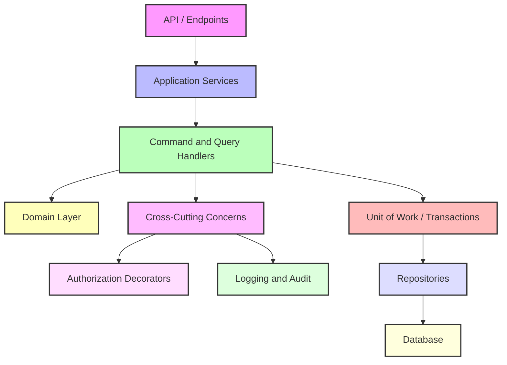

# Gamma.Kernel

**Gamma.Kernel** is a lightweight, opinionated .NET kernel for **CQRS, Clean Architecture, and DDD-based applications**.  
Gamma.Kernel helps you structure your app, enforce cross-cutting concerns, and keep your business logic clean — without locking you into a framework or database.

---

## Why Gamma.Kernel Exists

Building enterprise apps often leads to scattered logic for:

- Authorization and permissions
- Transactions and Unit of Work
- Query/Command handling
- Auditing and logging

Gamma.Kernel centralizes these concerns in a **minimal, reusable kernel** so you can focus on your domain.

---

## When to Use Gamma.Kernel

- Building enterprise or SaaS systems
- Maintaining a large codebase over years
- Implementing DDD, CQRS, or transaction-heavy workflows
- Avoiding heavy all-in-one frameworks
- Targeting .NET 10+ with modern tooling

---

## Key Features

- `ICommand`/`IQuery` and handler pipelines for CQRS
- DispatchProxy and decorator-based **authorization enforcement**
- Attribute-based entity helpers (`Identity`, `InsertOnly`, `RowVersion`)
- Dapper Micro-ORM integration – generic CUD repositories, transactional support, attribute-based entity mapping (Identity, InsertOnly, RowVersion)
- Unit of Work & transaction context management
- Audit helpers – optional per entity, minimal boilerplate
- Infrastructure abstractions: `IClock`, `ICurrentUser`

> Opinionated, but framework-agnostic — works with any .NET 10+ app.

---

## Quick Start (Setup Guide)

To run the project locally and execute test scenarios, follow these steps:

1. **Create a Test Database**

Open SQL Server and create a new database for testing:

```sql
CREATE DATABASE [gamma-next];
GO
```

2. **Check appSettings.json**

   Open appsettings.json file and check connection string.

3. **Run script in database**

   Open db-script.sql and run it in [gamma-next] database.

4. **Test Endpoints**

   Press F5, {{ur}}/swagger/index.html

---

## Roadmap

- **Domain events abstraction** – standardize event publishing across your domain
- **Outbox pattern support** – reliable message delivery for distributed systems
- **Improved diagnostics & observability hooks** – metrics, logging, and tracing for pipelines and transactions
- **Application generator from entities** – scaffold application layers (commands, queries, DTOs) automatically
- **CQRS pipeline extensions** – add custom behaviors, middleware, and cross-cutting features
- **Test harnesses & examples** – ready-to-run samples for contributors to experiment safely

---

## Suggested Solution Structure

```
/src
  ├─ Gamma.Kernel
  │   ├─ Abstractions
  │   ├─ Behaviors
  │   ├─ Transactions
  │   └─ Common
  │
  ├─ MyApp.Domain
  │   ├─ Entities
  │   ├─ ValueObjects
  │   └─ DomainServices
  │
  ├─ MyApp.Application
  │   ├─ Commands
  │   ├─ Queries
  │   ├─ Services (Application)
  │   └─ DTOs
  │
  ├─ MyApp.Infra
  │   ├─ Data
  │   ├─ Logging
  │   └─ Services (External)
  │
  └─ MyApp.Api
      ├─ EndPoints
```

---

## Architecture Overview


